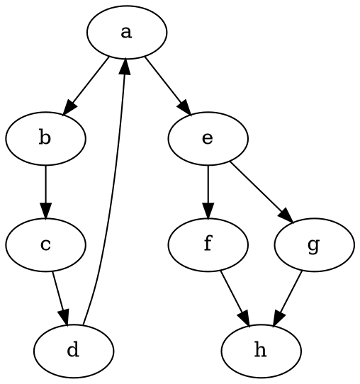

# CSE 464 — Project Part 3 README

**Student:** arsule375  
**Repository:** [arsule375/CSE464-project-p3](https://github.com/arsule375/CSE464-project-p3)  
**Branch:** `refactor-updated`  
**Date:** May 5, 2026

---

## Table of Contents

1. [Build Instructions](#build-instructions)
2. [New Features: BFS, DFS, Random Walk Search](#new-features)
3. [How to Run Each Search](#how-to-run-each-search)
4. [Expected Output Screenshots](#expected-output)
5. [GitHub Commit Links](#github-commit-links)

---

## Build Instructions

Ensure you have **Java JDK 11+** and **Maven 3.6+** installed.

```bash
# Navigate to the project directory
cd CSE464-GraphManager

# Compile and package (runs all tests)
mvn package
```

All tests pass and the JAR is produced at:

```
target/CSE464-GraphManager-1.0-SNAPSHOT.jar
```

---

## New Features

### Feature 5 — Graph Search (BFS / DFS / Random Walk)

Three search strategies find a path between a source and destination node in the parsed graph.

| Algorithm | Class | Strategy |
|-----------|-------|----------|
| BFS | Built into `GraphManager` | Breadth-first, explores level by level |
| DFS | Built into `GraphManager` | Depth-first, explores deepest path first |
| Random Walk | `RandomWalkSearch` | Randomly picks an unvisited neighbor at each step |

**Design Patterns Used:**

- **Template Method Pattern** — `GraphSearchTemplate` (abstract class) provides shared helper methods (`isSearchable`, `buildPath`, `printVisit`, `getUnvisitedNeighbors`) used by all strategies.
- **Strategy Pattern** — `SearchStrategy` interface allows plugging in any search algorithm (`BFS`, `DFS`, or `RandomWalkSearch`) at runtime.

---

## How to Run Each Search

### Option A — Run the Demo Traversal Runner (Recommended)

The `DemoTraversalRunner` class prints full BFS, DFS, and Random Walk traversal histories for the graph in `input.dot` (source = `a`, destination = `h`).

```bash
cd CSE464-GraphManager
mvn package -q

java -cp "target/CSE464-GraphManager-1.0-SNAPSHOT.jar:$(find ~/.m2 -name '*.jar' | tr '\n' ':')" \
     asu.cse464.DemoTraversalRunner
```

> **Note:** On Windows, replace `:` with `;` in the classpath separator.

### Option B — Use the GraphManager API in Code

```java
GraphManager gm = new GraphManager();
gm.parseGraph("src/main/resources/input.dot");

// BFS
Path bfsPath = gm.GraphSearch(
    new Node("a"), new Node("h"), GraphManager.Algorithm.BFS
);

// DFS
Path dfsPath = gm.GraphSearch(
    new Node("a"), new Node("h"), GraphManager.Algorithm.DFS
);

// Random Walk
Map<String, List<String>> adjacency = /* build adjacency map */;
SearchStrategy rw = new RandomWalkSearch();
Path rwPath = rw.search("a", "h", adjacency);
```

### Option C — Run Tests

```bash
cd CSE464-GraphManager
mvn test
```

Tests are in:
- `src/test/java/asu/cse464/GraphManagerTest.java` — BFS/DFS tests
- `src/test/java/asu/cse464/RandomWalkSearchTest.java` — Random Walk tests

---

## Expected Output

### Input Graph (`input.dot`)



**Graph structure:**

```
a → b → c → d → (back to a)
a → e → f → h
        e → g → h
```

---

### BFS Output (source: `a`, destination: `h`)

```
BFS:
Path Progression: a
Path Progression: a-b
Path Progression: a-e
Path Progression: a-b-c
Path Progression: a-e-f
Path Progression: a-e-g
Path Progression: a-b-c-d
Path Progression: a-e-f-h
Found target node: h
Final Path: a-e-f-h
```

**BFS explores nodes level by level.** It finds `h` via `a→e→f→h` (shortest path in terms of hops).

---

### DFS Output (source: `a`, destination: `h`)

```
DFS:
Path Progression: a
Path Progression: a-b
Path Progression: a-b-c
Path Progression: a-b-c-d
Path Progression: a-e
Path Progression: a-e-f
Path Progression: a-e-f-h
Found target node: h
Final Path: a-e-f-h
```

**DFS goes as deep as possible first.** It backtracks when a dead end is reached and eventually finds `h` via `a→e→f→h`.

---

### Random Walk Output (source: `a`, destination: `h`)

```
Random Walk (no backtracking, unvisited neighbors only):
Run 1:
Visit Node History: a
Visit Node History: a-e
Visit Node History: a-e-f
Visit Node History: a-e-f-h
Found target node: h
Run 2:
Visit Node History: a
Visit Node History: a-e
Visit Node History: a-e-f
Visit Node History: a-e-f-h
Found target node: h
Run 3:
Visit Node History: a
Visit Node History: a-e
Visit Node History: a-e-g
Visit Node History: a-e-g-h
Found target node: h
...
Random Walk runs completed: 5
Distinct successful paths found: 2
```

**Random Walk randomly selects an unvisited neighbor** at each step. Multiple runs may find different paths. In the example above, two distinct paths were found: `a→e→f→h` and `a→e→g→h`.

---

### `mvn package` Build Output

```
[INFO] --- maven-surefire-plugin:2.22.2:test ---
[INFO] Tests run: X, Failures: 0, Errors: 0, Skipped: 0
[INFO] BUILD SUCCESS
```

---

## GitHub Commit Links

### Refactoring Commits (Strategy / Template Method Pattern)

| Description | Commit |
|-------------|--------|
| Refactor: extract `buildAdjacencyMap` method | [3ca6faf](https://github.com/arsule375/CSE464-project-p3/commit/3ca6faf) |
| Extract `reconstructPath` method for both searches | [f23d17d](https://github.com/arsule375/CSE464-project-p3/commit/f23d17d) |
| `buildDotString` extraction | [fe11976](https://github.com/arsule375/CSE464-project-p3/commit/fe11976) |
| Extract `addPathEdges` into `Path` class | [1de7366](https://github.com/arsule375/CSE464-project-p3/commit/1de7366) |
| Address PR review feedback for refactor safety and clarity | [4769f40](https://github.com/arsule375/CSE464-project-p3/commit/4769f40) |

### Random Walk Feature Commits

| Description | Commit |
|-------------|--------|
| Add `RandomWalkSearch` strategy and template implementation | [9da1e83](https://github.com/arsule375/CSE464-project-p3/commit/9da1e83) |
| Address PR #2 review comments for random walk behavior | [f8474b2](https://github.com/arsule375/CSE464-project-p3/commit/f8474b2) |
| Add test case | [cee170f](https://github.com/arsule375/CSE464-project-p3/commit/cee170f) |
| Add `DemoTraversalRunner` | [94ff5b7](https://github.com/arsule375/CSE464-project-p3/commit/94ff5b7) |
| Edits to path test | [5d17821](https://github.com/arsule375/CSE464-project-p3/commit/5d17821) |

### Branch Links

| Branch | Link |
|--------|------|
| `main` | [arsule375/CSE464-project-p3/tree/main](https://github.com/arsule375/CSE464-project-p3/tree/main) |
| `refactor` | [arsule375/CSE464-project-p3/tree/refactor](https://github.com/arsule375/CSE464-project-p3/tree/refactor) |
| `refactor-updated` | [arsule375/CSE464-project-p3/tree/refactor-updated](https://github.com/arsule375/CSE464-project-p3/tree/refactor-updated) |

### Merge / PR Links

- **PR #1** — Refactor branch merged into main: [arsule375/CSE464-project-p3/pulls](https://github.com/arsule375/CSE464-project-p3/pulls)
- **PR #2** — Random Walk changes addressed: committed on `refactor-updated` branch

---

## Project Structure (Part 3)

```
CSE464-GraphManager/
├── pom.xml
├── input.dot                          ← Input graph for DemoTraversalRunner
├── src/
│   ├── main/java/asu/cse464/
│   │   ├── GraphManager.java          ← Core graph logic + BFS/DFS
│   │   ├── GraphSearchTemplate.java   ← Abstract template for search strategies
│   │   ├── SearchStrategy.java        ← Strategy interface
│   │   ├── RandomWalkSearch.java      ← Random Walk implementation
│   │   ├── Node.java                  ← Node model
│   │   ├── Path.java                  ← Path model
│   │   ├── DemoTraversalRunner.java   ← Prints BFS/DFS/RandomWalk traversals
│   │   ├── Main.java                  ← Demo for features 1-4
│   │   ├── EvidenceGenerator.java
│   │   └── ProofGenerator.java
│   └── test/java/asu/cse464/
│       ├── GraphManagerTest.java      ← BFS/DFS tests
│       └── RandomWalkSearchTest.java  ← Random Walk tests
└── evidence/
    └── search-paths.txt
```
