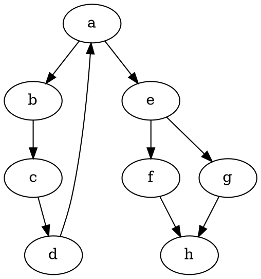

# CSE 464 - Project Part 3 README (Submission)

Student: arsule375  
Repository: [arsule375/CSE464-project-p3](https://github.com/arsule375/CSE464-project-p3)  
Primary submission branch: `main`  
Feature development branches: `refactor`, `refactor-updated`  
Date: May 5, 2026

---

## Submission Checklist Coverage

- New README document created for this submission: `README_P3.md`
- Project compiles with `mvn package`
- Detailed run steps included for BFS, DFS, and Random Walk
- Screenshot section with placeholders included below (replace placeholders with actual images before final PDF export)
- GitHub commit links, branch links, and PR/merge links included
- Built binaries are not required for submission

---

## Build Instructions

Prerequisites:

- Java JDK 11+
- Maven 3.6+

Build command:

```bash
cd CSE464-GraphManager
mvn package
```

Expected artifact:

```text
target/CSE464-GraphManager-1.0-SNAPSHOT.jar
```

Latest verified build result:

```text
[INFO] Tests run: 35, Failures: 0, Errors: 0, Skipped: 0
[INFO] BUILD SUCCESS
```

---

## Feature Summary

Feature implemented for this part: graph search with BFS, DFS, and Random Walk.

| Algorithm | Implementation | Behavior |
|-----------|----------------|----------|
| BFS | `GraphManager` | Breadth-first exploration (level-order) |
| DFS | `GraphManager` | Depth-first exploration (go deep, then backtrack) |
| Random Walk | `RandomWalkSearch` | Random unvisited-neighbor walk until success/failure |

Patterns used:

- Template Method: `GraphSearchTemplate`
- Strategy: `SearchStrategy` with algorithm-specific implementations

---

## How To Run BFS / DFS / Random Walk

### Option A (Recommended): Demo runner output for all algorithms

```bash
cd CSE464-GraphManager
mvn package -q
java -cp "target/CSE464-GraphManager-1.0-SNAPSHOT.jar:$(find ~/.m2 -name '*.jar' | tr '\n' ':')" asu.cse464.DemoTraversalRunner
```

Note for Windows: use `;` instead of `:` in classpath separators.

### Option B: Run tests

```bash
cd CSE464-GraphManager
mvn test
```

Test classes:

- `src/test/java/asu/cse464/GraphManagerTest.java` (BFS/DFS)
- `src/test/java/asu/cse464/RandomWalkSearchTest.java` (Random Walk)

---

## Expected Console Output

Input graph (`input.dot`):



Graph shape:

```text
a -> b -> c -> d -> (back to a)
a -> e -> f -> h
       e -> g -> h
```

### BFS output (src=a, dst=h)

```text
BFS:
Path Progression: a
Path Progression: a-b
Path Progression: a-e
Path Progression: a-b-c
Path Progression: a-e-f
Path Progression: a-e-g
Path Progression: a-b-c-d
Path Progression: a-e-f-h
Found target node: h
Final Path: a-e-f-h
```

### DFS output (src=a, dst=h)

```text
DFS:
Path Progression: a
Path Progression: a-b
Path Progression: a-b-c
Path Progression: a-b-c-d
Path Progression: a-e
Path Progression: a-e-f
Path Progression: a-e-f-h
Found target node: h
Final Path: a-e-f-h
```

### Random Walk output (sample run)

```text
Random Walk (no backtracking, unvisited neighbors only):
Run 1:
Visit Node History: a
Visit Node History: a-e
Visit Node History: a-e-f
Visit Node History: a-e-f-h
Found target node: h
...
Random Walk runs completed: 5
Distinct successful paths found: 2
```

---

## Screenshot Placeholders (Replace Before PDF Export)

Add images under `CSE464-GraphManager/evidence/` (or another tracked folder), then replace these placeholders with embedded images.

Required screenshots:

1. `mvn package` successful build output
2. BFS run output
3. DFS run output
4. Random Walk run output
5. Test summary (`Tests run: 35, Failures: 0, Errors: 0, Skipped: 0`)

Placeholder block to replace:

```text
[Screenshot 1: mvn package success]
[Screenshot 2: BFS output]
[Screenshot 3: DFS output]
[Screenshot 4: Random Walk output]
[Screenshot 5: mvn test summary]
```

---

## GitHub Links (Commits, Branches, PR/Merge)

### Refactor commits

| Description | Commit |
|-------------|--------|
| Extract `buildAdjacencyMap` | [3ca6faf](https://github.com/arsule375/CSE464-project-p3/commit/3ca6faf) |
| Extract `reconstructPath` | [f23d17d](https://github.com/arsule375/CSE464-project-p3/commit/f23d17d) |
| Extract `buildDotString` | [fe11976](https://github.com/arsule375/CSE464-project-p3/commit/fe11976) |
| Extract path edge helper into `Path` | [1de7366](https://github.com/arsule375/CSE464-project-p3/commit/1de7366) |
| Refactor review fixes | [4769f40](https://github.com/arsule375/CSE464-project-p3/commit/4769f40) |

### Random Walk and traversal commits

| Description | Commit |
|-------------|--------|
| Add `RandomWalkSearch` strategy | [9da1e83](https://github.com/arsule375/CSE464-project-p3/commit/9da1e83) |
| Address PR #2 review comments | [f8474b2](https://github.com/arsule375/CSE464-project-p3/commit/f8474b2) |
| Add Random Walk test case updates | [cee170f](https://github.com/arsule375/CSE464-project-p3/commit/cee170f) |
| Add `DemoTraversalRunner` | [94ff5b7](https://github.com/arsule375/CSE464-project-p3/commit/94ff5b7) |
| Path test edits | [5d17821](https://github.com/arsule375/CSE464-project-p3/commit/5d17821) |
| Latest integration update | [fc41adc](https://github.com/arsule375/CSE464-project-p3/commit/fc41adc) |

### Branch links

- Main submission branch: [main](https://github.com/arsule375/CSE464-project-p3/tree/main)
- Refactor branch: [refactor](https://github.com/arsule375/CSE464-project-p3/tree/refactor)
- Updated feature branch: [refactor-updated](https://github.com/arsule375/CSE464-project-p3/tree/refactor-updated)

### PR / merge links

- PR #2 (feature branch merged): [Pull Request #2](https://github.com/arsule375/CSE464-project-p3/pull/2)
- Main branch merge sync commit: [694ddf8](https://github.com/arsule375/CSE464-project-p3/commit/694ddf8)

---

## Project Structure

```text
CSE464-GraphManager/
|- pom.xml
|- input.dot
|- src/
|  |- main/java/asu/cse464/
|  |  |- GraphManager.java
|  |  |- GraphSearchTemplate.java
|  |  |- SearchStrategy.java
|  |  |- RandomWalkSearch.java
|  |  |- DemoTraversalRunner.java
|  |  |- Node.java
|  |  |- Path.java
|  |  |- Main.java
|  |  |- EvidenceGenerator.java
|  |  \- ProofGenerator.java
|  \- test/java/asu/cse464/
|     |- GraphManagerTest.java
|     \- RandomWalkSearchTest.java
\- evidence/
   \- search-paths.txt
```
